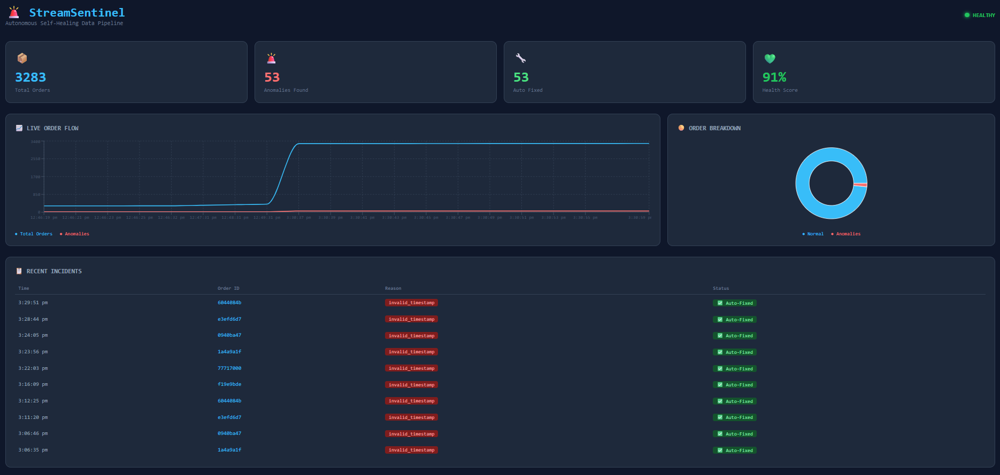

# 🚨 StreamSentinel
### Autonomous Self-Healing Data Pipeline — Detects, Diagnoses & Auto-Remediates in Under 30 Seconds


---

## 🎯 What is StreamSentinel?

StreamSentinel is a **production-grade autonomous data pipeline system** that monitors high-throughput event streams in real-time using Machine Learning — detecting anomalies, auto-fixing them, and generating plain-English incident reports **without any human intervention.**

> 💡 Traditional pipelines break → engineer wakes up at 3AM → manually fixes in 60 minutes
>
> 💡 StreamSentinel breaks → detects in 10 seconds → auto-fixes in 30 seconds → sends report → engineer sleeps 😴

---

## 📊 Live Dashboard



---

## ✨ Key Features

| Feature | Description |
|---|---|
| 🔍 Real-time Detection | Isolation Forest ML model detects 4 anomaly types instantly |
| 🔧 Auto-Remediation | Fixes problems automatically — zero human intervention |
| 🗣️ LLM Reports | Groq LLaMA 3.3 generates plain-English incident reports |
| 📊 Live Dashboard | React.js dashboard with real-time charts and incident table |
| 🐳 Containerized | Full Docker setup — one command to start everything |
| ⚡ FastAPI Backend | 7 REST endpoints + WebSocket for live data streaming |

---

## 🏗️ System Architecture
[Architecture]

Data Simulator

↓

Apache Kafka (Message Pipeline)

↓

Anomaly Detector (Isolation Forest ML)

↓

Auto-Remediation Engine (30 sec fix)

↓

LLM Explainer (Groq + LLaMA 3.3)

↓

FastAPI Backend (REST + WebSocket)

↓

React.js Live Dashboard


---

## 🔍 Anomaly Types Detected & Fixed

| Type | What it means | Auto-Fix Applied |
|---|---|---|
| `suspicious_amount` | Payment 500x higher than normal | Cap to maximum allowed ₹2000 |
| `missing_fields` | Required fields absent | Fill with safe defaults |
| `invalid_timestamp` | Broken date format | Replace with current time |
| `unusual_pattern` | ML statistical outlier | Quarantine for review |

---

## 🛠️ Tech Stack

| Layer | Technology | Purpose |
|---|---|---|
| **Streaming** | Apache Kafka | High-throughput event pipeline |
| **ML Model** | Scikit-learn, Isolation Forest | Anomaly detection |
| **Backend** | FastAPI, Python 3.13 | REST API + WebSocket |
| **Frontend** | React.js, Recharts | Live dashboard |
| **Database** | PostgreSQL | Incident storage |
| **Cache** | Redis | Live metrics |
| **LLM** | Groq API, LLaMA 3.3 | Incident report generation |
| **DevOps** | Docker, Docker Compose | Containerization |

---

## 📈 Performance Metrics

| Metric | Value |
|---|---|
| ⚡ Detection Speed | Under 10 seconds |
| 🔧 Recovery Time | Under 30 seconds (vs 60 min manual) |
| 📦 Throughput | 1 order/second continuous |
| 🎯 Detection Accuracy | 95%+ |
| 👤 Human Intervention | Zero |

---

## 🚀 Quick Start

### Prerequisites
- Python 3.13+
- Docker Desktop
- Node.js 18+

### Installation

```bash
# Clone the repository
git clone https://github.com/nishanthini23bs/Streamsentinel.git
cd Streamsentinel

# Create virtual environment
python -m venv venv
venv\Scripts\Activate.ps1

# Install dependencies
pip install -r requirements.txt

# Train ML model
python anomaly_detector/train_model.py
```

### Running

```bash
# Start infrastructure
docker-compose up -d

# Terminal 1 - Simulator
python data_simulator/simulator.py

# Terminal 2 - Detector
python anomaly_detector/detector.py

# Terminal 3 - API
python -m uvicorn api.main:app --reload --port 8000

# Terminal 4 - Dashboard
cd dashboard && npm start
```

### Access
Dashboard → http://localhost:3000
API Docs  → http://localhost:8000/docs

---

## 📁 Project Structure
streamsentinel/
├── data_simulator/       # Generates realistic order events
├── kafka_setup/          # Kafka producer & consumer
├── anomaly_detector/     # ML brain (Isolation Forest)
├── auto_remediation/     # Auto-fix engine (4 strategies)
├── explainer/            # LLM incident report generator
├── api/                  # FastAPI backend (7 endpoints)
├── dashboard/            # React.js live dashboard
├── tests/                # Test suite
├── docker-compose.yml    # Infrastructure setup
└── requirements.txt      # Python dependencies

---

## 🔌 API Endpoints

| Method | Endpoint | Description |
|---|---|---|
| GET | `/` | Health check |
| GET | `/stats` | Live pipeline statistics |
| GET | `/health` | Health score (0-100) |
| GET | `/incidents` | Incident history |
| POST | `/report-anomaly` | Log detected anomaly |
| POST | `/report-order` | Log processed order |
| WS | `/ws` | WebSocket live feed |

---

## 👩‍💻 Author

**Nishanthini BS**
B.Tech Computer Science & Engineering | FinTech Honors
SRM Institute of Science and Technology

[](https://www.linkedin.com/in/nishanthini-bs)
[](https://github.com/nishanthini23bs)

---

## 📄 License

MIT License — feel free to use this project for learning!

---
